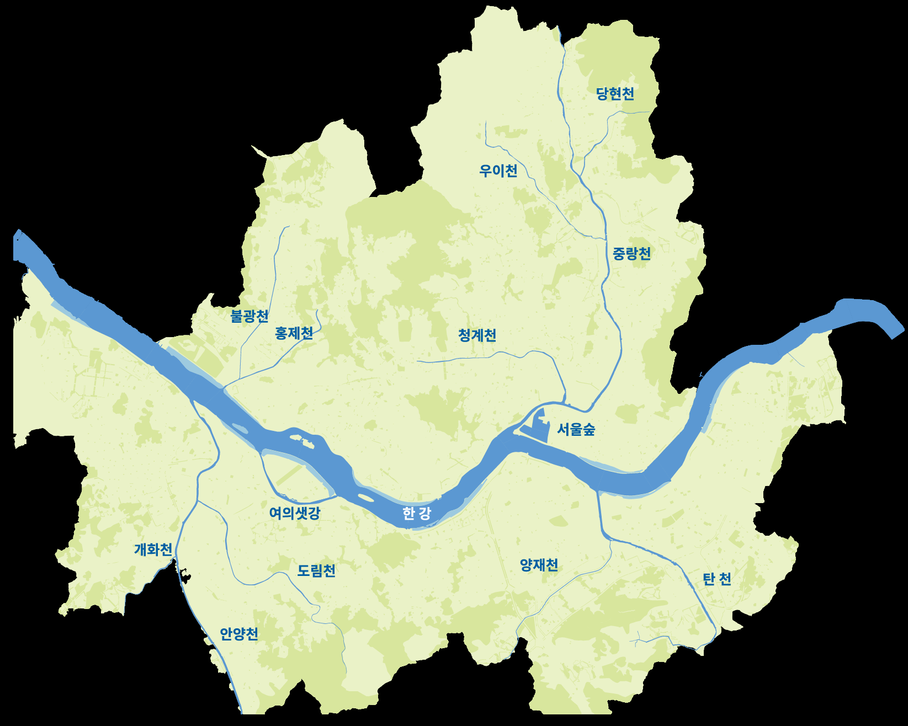
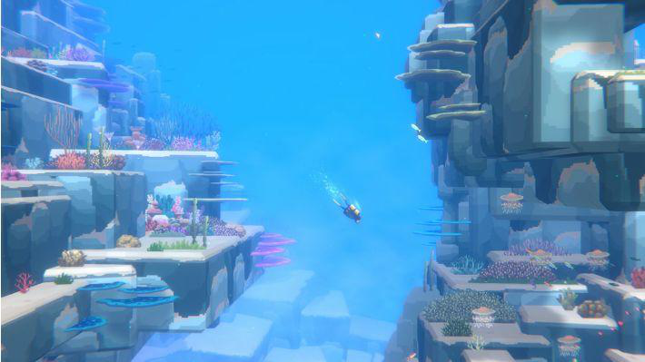
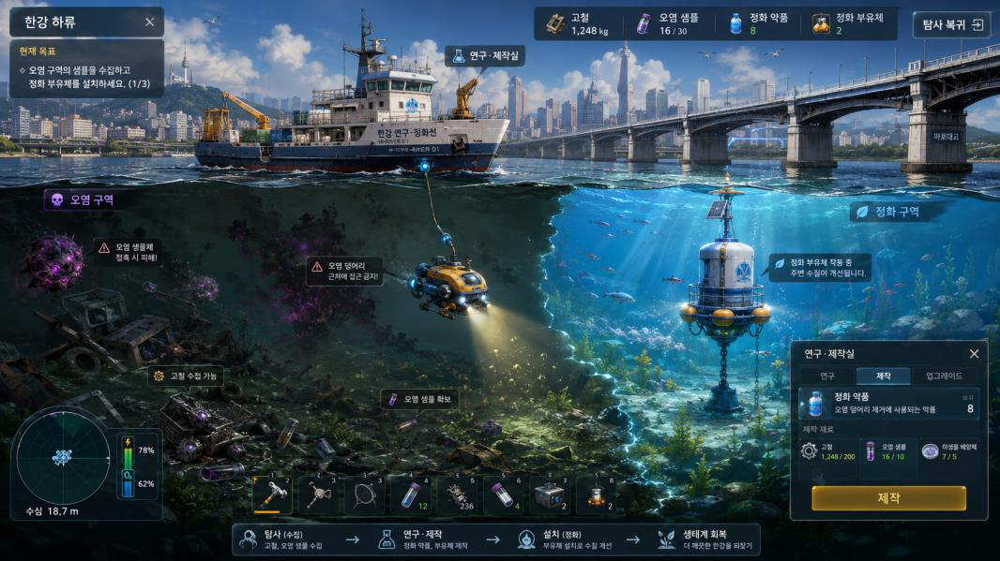
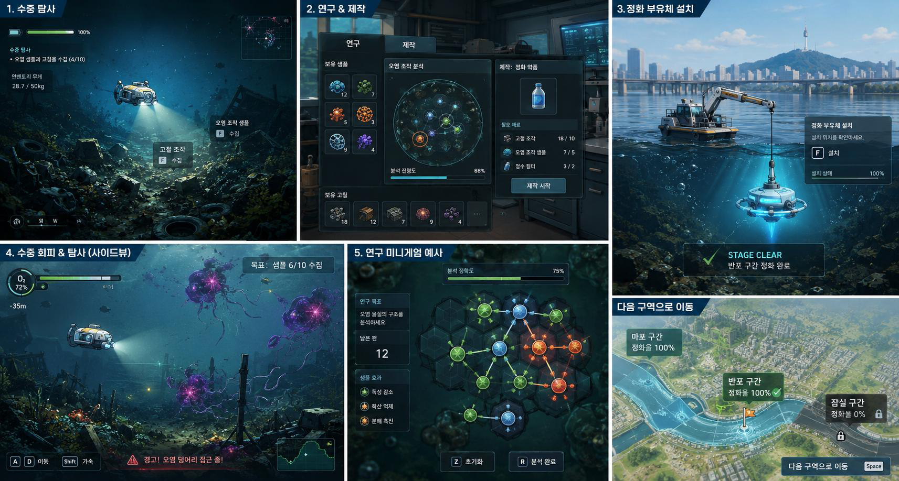

# NC 플레이업 제안서 — 한강 오염 탐사 게임 기획서

> **팀**: 콩기름팀 (손현빈, 유석)
> **키워드**: 한강 오염 탐사, 제작, 수중 탐험, 퍼즐 + 엔지니어링
> **플랫폼**: PC (Unity)

---

## 1. 핵심 콘셉트 & 시나리오

1. 한강의 오염으로 인한 생태계 변형
2. 한강 탐사를 통한 오염 요소 제거 목표 (낮)
3. 쓰레기와 오염 샘플을 수거하여 연구/장비 제작 (밤)
4. 오염을 회피하고 장애물을 넘는 게임
5. 하류에서 상류로, 해금되는 구역
6. 하류에서 시작하여 오염을 정화하고, **상류의 오염원에 도달하는 것**이 목표

---

## 2. 코어 플레이

> 플레이어는 **정화선**을 거점으로 삼아 탐사와 제작을 반복하며 탐사 기계를 성장시킨다.

| 단계 | 내용 |
|------|------|
| **1. 탐사 준비** | 정화선에서 현재 구역의 오염 상태, 목표 자원, 필요한 정화 약품 제작 조건을 확인 |
| **2. 수중 탐사** | 탐사 기계를 한강 수중으로 내려보내 오염 지역을 조사 (2.5D 시점, 좌우 이동 + 상하 탐색) |
| **3. 자원 수집** | 고철·폐기물·오염 조직 샘플을 상호작용 키로 획득. 인벤토리 무게 제한 초과 시 정화선 복귀 필요 |
| **4. 위험 회피** | 해류를 따라 움직이는 오염 생물체/덩어리와 충돌 시 탐사 강제 종료 후 정화선 복귀 |
| **5. 연구 및 제작** | 오염 샘플은 연구에, 고철·재료는 정화 장치 제작에 사용. 연구로 오염 특성 분석 시 구역별 정화 약품 제작 가능 |
| **6. 정화 부유체 설치** | 정화 약품·부유체 제작 완료 후 지정 위치에 설치 → 수질 회복, 스테이지 클리어 연출 |

---

## 3. 플레이 스펙

| 항목 | 내용 |
|------|------|
| 플랫폼 | PC |
| 조작 | 키보드 & 마우스 (이동: WASD + 근처 버튼 / UI·퍼즐: 마우스) |
| 플레이 타임 | 5분 |
| 스테이지 수 | 1개 |
| 목표 | 정화 부유체 설치 후 해당 구역 정화 |

### 핵심 구현 시스템

| 시스템 | 구현 내용 |
|--------|-----------|
| 플레이어 조작 | 탐사 기계 이동 |
| 수중 탐사 | 2.5D 사이드뷰 수중 맵 |
| 자원 수집 | 고철, 오염 샘플 수집 |
| 인벤토리 | 수집 자원 개수 표시 |
| 복귀 시스템 | 정화선으로 돌아가기 |
| 제작 시스템 | 정화 약품 / 정화 부유체 제작 |
| 설치 시스템 | 지정 위치에 정화 부유체 설치 |
| 정화 연출 | 오염 구역이 맑아지는 시각 변화 |
| 클리어 처리 | 스테이지 클리어 UI |

---

## 4. 핵심 시스템

### (1) 수중 탐사
탐사 기계를 조작하여 한강 수중을 탐험하는 핵심 시스템. 2.5D 환경에서 상하좌우(WASD) 이동.
플레이어는 제한된 **산소·배터리·적재 무게**를 관리하며 자원을 수집한다.
깊은 지역일수록 희귀한 재료와 중요한 오염 샘플이 존재하지만, 위험 요소도 함께 증가.

**주요 요소**
- 탐사 기계 조작
- 고철 수집 / 오염 샘플 수집
- 인벤토리 무게 제한
- 산소 또는 배터리 제한
- 깊이에 따른 위험도 증가
- 정화선 복귀 판단

> 레퍼런스: *데이브 더 다이버*

### (2) 수중 회피
오염된 한강에는 해류를 따라 이동하는 오염 덩어리·오염 생물체·독성 입자가 존재.
충돌 시 탐사 기계가 손상되거나 강제로 정화선으로 복귀.

**오염원 등장 방식**
- 일정 시간마다 해류 방향을 따라 이동
- 특정 구역에 접근하면 활성화
- 오염 농도가 높은 지역에서 다수 등장
- 플레이어의 조명·소음에 반응
- 밤 시간대에는 더 공격적인 오염원 등장

> 🔧 프로토타입: 가장 단순한 형태로 **정해진 경로를 따라 움직이는 오염 덩어리**를 구현 예정.

### (3) 연구 — 오염 구조 연결 퍼즐
- 오염 샘플은 여러 개의 노드로 표현
- 같은 성질의 노드를 연결하거나 오염 반응을 안정화시키는 방식으로 퍼즐 풀이
- 정해진 턴 안에 오염 구조를 분석하면 연구 성공률 상승, 정화 약품 제작 레시피 해금

> ⚠️ 퍼즐 세부 디자인은 추가 검토 필요

### (4) 제작 — 정화 장치 조립 퍼즐
- 제한된 슬롯 안에 부품을 배치하여 정화 부유체를 완성
- 부품의 종류·배치에 따라 정화 범위, 작동 속도, 내구도가 달라짐

**제작 대상**
- 정화 부유체
- 탐사 기계 부품
- 배터리 업그레이드
- 적재량 증가 장치
- 수압 저항 장치
- 샘플 채취 장비 등

> 🔧 프로토타입: "탐사 기계 부품 업그레이드" 및 "정화 부유체" 제작만 구현 예정.

### (5) 오염 확산 시스템 *(중반 이후 전략 요소)*
- 한강은 상류로 갈수록 양재천·탄천 등 다양한 지천과 연결
- 지천에서 새로운 오염원이 발견되면 기존에 정화한 구역의 오염도가 다시 상승
- 새 구역 탐사와 기존 구역 오염도 관리를 병행 필요

> 🚫 프로토타입 미구현 — 정식 버전의 중후반 콘텐츠로 확장 예정.

### (6) 낮과 밤 *(정식 버전 확장 시스템)*
- 낮/밤에 따라 등장하는 오염원과 수집 가능한 재료가 달라짐
- 낮: 시야가 넓고 탐사가 안정적
- 밤: 희귀 샘플이 등장하는 대신 위험한 오염 생물체 증가

> 🚫 프로토타입 미구현 — 향후 확장 요소로 제안. (레퍼런스: *데이브 더 다이버*)

---

## 5. 프로토타입 시나리오 (5분 플레이)

| 시간 | 단계 | 내용 |
|------|------|------|
| **00:00 ~ 02:00** | 탐사 및 수집 (초반) | 탐사 기계로 수중 진입. 2.5D 배경과 서치라이트 연출 시연. 고철·오염원 샘플 수집 후 무게 제한 임계점 도달 시 정화선 귀환 |
| **02:00 ~ 04:00** | 연구 및 제작 (중반) | 귀환 후 UI 전환. 샘플을 미니게임으로 분석하여 '정화 약품' 레시피 해금. 고철 조합으로 '정화 부유체' 제작 및 기계 업그레이드 |
| **04:00 ~ 05:00** | 정화 및 클리어 (후반) | 정화 부유체를 한강 특정 스팟에 설치. 탁한 물이 정화되는 파티클 연출과 함께 스테이지(구역) 클리어 및 다음 구역 진행 |

---

## 6. 구현 범위

### ✅ 구현 대상 (프로토타입)
- 정화선 거점 화면
- 탐사 기계 조작
- 2.5D 수중 탐사 구역
- 고철 수집 / 오염 샘플 수집
- 인벤토리 무게 제한
- 단순 오염원 회피
- 연구 UI / 제작 UI
- 정화 약품 제작 / 정화 부유체 제작 / 정화 부유체 설치
- 스테이지 클리어 연출
- 정화 전/후 환경 변화

### 🔜 추후 구현 (정식 버전)
- 낮/밤 시스템
- 스테이지 확장
- 오염 확산 시스템
- 업그레이드 트리
  - *프로토타입에서는 일정량의 재료 수급 시 버튼 클릭으로 업그레이드 진행*
- 다양한 오염원 AI
- 컷신 연출

---

## 7. 예시 이미지 (GPT 활용)

### 메인 콘셉트 씬 — 한강 하류 (정화선 거점 + 수중 탐사)

### UI 목업
정화선 거점, 수중 탐사/회피, 연구·제작, 정화 부유체 설치, 다음 구역 이동 흐름을 보여주는 화면 목업.

> 위 이미지는 GPT로 생성한 콘셉트 시안이며 실제 아트 방향과 다를 수 있습니다.

---

## 8. 참고 노트 — UI 디자인

### Impeccable (웹 프론트 디자인 스킬) — UI 작업 시 *원칙만* 참고
- 출처: https://github.com/pbakaus/impeccable (Apache 2.0, NPM CLI)
- **정체**: 웹/프론트엔드(타이포·OKLCH 색·스페이싱·모션·폼·UX카피) 디자인 가이드. **3D/게임/Unity/셰이더와 무관** → 게임 월드(블록·라이팅·god ray·구도) 비주얼엔 도움 안 됨.
- **언제 참고**: 본격 **2D UI/HUD**(거점 UI·연구/제작 패널·인벤토리·토스트·게이지) 만들 때, 아래 *원칙*만 체크리스트로 활용(도구 설치·실행은 불필요, Unity uGUI에 자동 적용 안 됨):
  - **색**: semantic color(성공=초록/오류=빨강/경고=주황/정보=파랑), 60/30/10(주색/보조/강조), "strategic color > rainbow vomit" — 강조색은 주요 행동·현재 선택·상태에만.
  - **타이포**: 모듈러 스케일(일관된 크기 단계), 폰트 페어링 절제.
  - **스페이싱**: 일관된 간격 시스템(8px 등 리듬), 시각적 위계.
  - **모션**: easing 곡선(선형 금지), stagger, reduced-motion 배려.
  - **UX 카피**: 버튼 라벨·에러 메시지·빈 상태(empty state) 문구를 명확하게.
- **결론**: 도입(설치) X. UI 다듬을 때 위 원칙을 사람이 수동 적용. (조사 2026-06-08)
